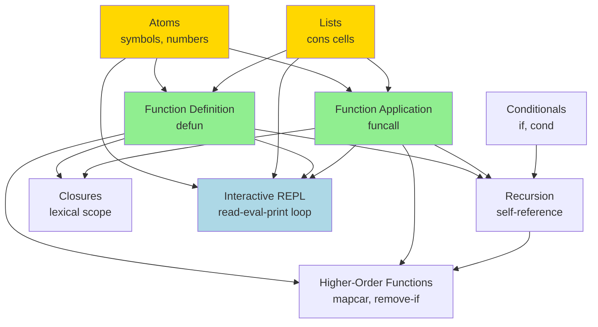

# DESIGN.md - Little PAIPer Architecture

## Purpose
This document explains the technical architecture, design decisions, and key concepts for developers who want to understand, extend, or maintain the Little PAIPer system.

**Audience:** Developers, contributors, Peter/Mike/James (technical review)

---

## How to Review This Document

**If you have 15 minutes:** Read "Core Concepts" + "Key Algorithms"  
**If you have 30 minutes:** Add "Design Decisions"  
**If you have 1 hour:** Read everything + skim NOTES.md for context  
**If you have 2 hours:** Deep dive into code + try the live demo

**Questions we're hoping to discuss:**
1. Is the multi-pass PCG extraction approach sound?
2. Should we validate LLM-generated prerequisites with symbolic reasoning?
3. How to handle example adaptation without breaking correctness?

---

## Try It Live

**Local development:**
```bash
cd learning
npm install
npm run dev
```
Then open http://localhost:3000

**Quick demo path:**
1. Click "Interactive REPL" (root concept in the graph)
2. Click "Start Learning" 
3. Have a short Socratic dialogue
4. Observe RAG-grounded responses (uses actual PAIP text)
5. Mark as mastered → see graph update in real-time

---

## Table of Contents
1. [Core Concepts](#core-concepts)
2. [System Architecture](#system-architecture)
3. [Data Pipeline](#data-pipeline)
4. [Component Design](#component-design)
5. [Key Algorithms](#key-algorithms)
6. [Novel Contributions](#novel-contributions)
7. [Design Decisions](#design-decisions)
8. [Questions for Peter](#questions-for-peter)
9. [Open Questions](#open-questions)
10. [What We Learned Building This](#what-we-learned-building-this)
11. [Future Directions](#future-directions)

---

## Core Concepts

### The Pedagogical Concept Graph (PCG)

**What it is:**
- A directed acyclic graph (DAG) where nodes are concepts and edges are "requires" relationships
- Enriched with learning objectives, mastery indicators, examples, and misconceptions
- Extracted from educational materials (textbooks, notebooks, tutorials)

**Why it matters:**
- The PCG is the **essence** of a textbook - the implicit structure made explicit
- Once extracted, enables multiple learning modalities from the same source
- Graph structure supports non-linear, personalized learning paths

**Data structure:**
```json
{
  "concepts": [
    {
      "id": "recursion",
      "name": "Recursion",
      "prerequisites": ["defun", "function_application"],
      "learning_objectives": [...],
      "mastery_indicators": [...],
      "examples": [...]
    }
  ],
  "edges": [
    {"from": "recursion", "to": "defun", "type": "requires"}
  ]
}
```

**Example PCG (PAIP Chapter 1 subset):**



**Legend:**
- 🟡 Gold = Mastered (foundation unlocked)
- 🟢 Green = Ready to Learn (prerequisites met)
- ⚪ White = Locked (need prerequisites first)

---

## System Architecture

### Three-Layer Architecture

```graphviz
digraph architecture {
  rankdir=TB;
  node [shape=box, style=rounded];
  
  subgraph cluster_frontend {
    label="Frontend (Next.js)";
    style=filled;
    color=lightblue;
    
    ConceptGraph [label="ConceptGraph\n(Cytoscape.js)"];
    SocraticDialogue [label="SocraticDialogue\n(React Modal)"];
    ConceptDetails [label="ConceptDetails\n(Sidebar)"];
  }
  
  subgraph cluster_api {
    label="API Layer (Next.js API Routes)";
    style=filled;
    color=lightgreen;
    
    API [label="/api/socratic-dialogue\n• RAG retrieval\n• LLM prompt construction\n• Mastery assessment"];
  }
  
  subgraph cluster_data {
    label="Data Layer";
    style=filled;
    color=lightyellow;
    
    PCG [label="concept-graph.json\n(PCG)"];
    Embeddings [label="embeddings.json\n(RAG vectors)"];
    LocalStorage [label="localStorage\n(progress)"];
  }
  
  Gemini [label="Gemini 2.5 Flash\n+ embedding-001", shape=ellipse, color=orange, style=filled];
  
  ConceptGraph -> API [label="REST"];
  SocraticDialogue -> API [label="REST"];
  ConceptDetails -> API [label="REST"];
  
  API -> Gemini [label="LLM calls"];
  API -> PCG [label="read"];
  API -> Embeddings [label="read"];
  
  ConceptGraph -> LocalStorage [label="read/write"];
  SocraticDialogue -> LocalStorage [label="read/write"];
}
```



### Technology Stack

**Frontend:**
- Next.js 15 (React 19, TypeScript)
- Cytoscape.js for graph visualization
- Tailwind CSS + shadcn/ui components
- react-markdown for rich text rendering

**Backend:**
- Next.js API Routes (serverless functions)
- Gemini 2.5 Flash for dialogue
- gemini-embedding-001 for RAG

**Data:**
- Static JSON files (no database required for MVP)
- localStorage for client-side persistence
- File-based vector search (cosine similarity)

---

## Data Pipeline

### Stage 0: PCG Extraction (Multi-Pass)

```
Pass 1: Structure Extraction
  Input: paip-chapter-1.md
  LLM Task: Identify concepts and dependencies
  Output: Concept nodes + prerequisite edges (DAG)

Pass 2: Mastery Criteria
  Input: Pass 1 output + source text
  LLM Task: Design learning objectives and assessment
  Output: Mastery indicators, examples, misconceptions

Pass 3: Exercise Mapping
  Input: Pass 1 + Pass 2 + textbook exercises
  LLM Task: Link exercises to concepts
  Output: Exercise-to-concept mappings
```

### Stage 1: RAG Pipeline (One-Time)

```
Semantic Chunking (chunk-paip.ts)
  Input: paip-chapter-1.md
  LLM Task: Split into semantic units
  Output: 92 chunks with metadata

Embedding Generation (embed-chunks.ts)
  Input: chunks.json
  API: gemini-embedding-001
  Output: 3072-dim vectors per chunk
```

### Stage 2: Runtime (Per Dialogue Turn)

```graphviz
digraph runtime_flow {
  rankdir=TB;
  node [shape=box, style=rounded];
  
  UserInput [label="User Input", shape=ellipse, color=lightblue, style=filled];
  APIRoute [label="API Route\n/api/socratic-dialogue"];
  LoadData [label="Load Data\n• Concept info\n• Cached textbook context", color=lightyellow, style=filled];
  RAG [label="RAG Retrieval\n• Embed query\n• Cosine similarity\n• Top-K chunks", color=lightgreen, style=filled];
  BuildPrompt [label="Build Prompt\n• Learning objectives\n• Textbook passages\n• Conversation history"];
  Gemini [label="Gemini 2.5 Flash", shape=ellipse, color=orange, style=filled];
  ParseJSON [label="Parse JSON Response\n• message\n• mastery_assessment"];
  UpdateUI [label="Update UI\n• Show message\n• Update progress bar\n• Enable mastery button", color=lightblue, style=filled];
  
  UserInput -> APIRoute;
  APIRoute -> LoadData;
  LoadData -> RAG [label="first turn only"];
  LoadData -> BuildPrompt;
  RAG -> BuildPrompt [label="textbook context"];
  BuildPrompt -> Gemini;
  Gemini -> ParseJSON;
  ParseJSON -> UpdateUI;
  UpdateUI -> UserInput [label="next turn", style=dashed];
}
```



---

## Component Design

### ConceptGraph.tsx

**Purpose:** Interactive graph visualization using Cytoscape.js

**Key features:**
- Multiple layout algorithms (dagre, breadthfirst, force-directed)
- Hover preview mode (non-destructive)
- Click-to-select with prerequisite highlighting
- Visual states: mastered (gold), ready (green glow), locked (faded)

**Design decisions:**
- Client component (`'use client'`) - requires browser APIs
- Ref-based Cytoscape initialization (can't treat as React component)
- Arrow direction reversed at render time (semantic vs visual)

### SocraticDialogue.tsx

**Purpose:** Modal for AI-guided learning sessions

**Key features:**
- Markdown rendering with syntax highlighting
- Real-time mastery tracking (progress bar)
- Auto-focus after LLM response (UX polish)
- Client-side textbook context caching

**Design decisions:**
- Structured JSON output from LLM (not free-form)
- Progress visualization only for concepts with mastery indicators
- Graceful degradation for basic concepts without indicators

### ConceptDetails.tsx

**Purpose:** Sidebar showing concept information

**Key features:**
- Human-readable learning paths (topological sort)
- Clickable prerequisite badges (navigation)
- Status-based sorting (mastered → ready → locked)
- Empty section suppression

---

## Key Algorithms

### 1. Topological Sort (Learning Path)

```typescript
function computePrerequisiteChain(
  conceptId: string,
  allConcepts: Concept[],
  masteredConcepts: Set<string>
): string[] {
  // DFS post-order traversal
  // Excludes already-mastered concepts
  // Returns ordered list: foundation → advanced
}
```

### 2. Semantic Search (RAG)

```typescript
function cosineSimilarity(a: number[], b: number[]): number {
  // Dot product / (||a|| * ||b||)
  // Returns 0.0 (orthogonal) to 1.0 (identical)
}

function retrieveRelevantChunks(query: string, topK: number) {
  // 1. Embed query → 3072-dim vector
  // 2. Compute similarity with all chunks
  // 3. Sort by similarity
  // 4. Return top K chunks
}
```

### 3. Mastery Assessment

```typescript
function evaluateMastery(tracker: MasteryTracker): boolean {
  // All basic skills ≥ 0.8
  // Most intermediate skills ≥ 0.7
  // Some advanced skills ≥ 0.6
}
```

---

## Novel Contributions

This project introduces several novel approaches to AI-powered education:

1. **Multi-pass PCG extraction:** Structure → Pedagogy → Exercises
   - Separates cognitive tasks for better LLM output quality
   - Enables incremental validation and refinement
   - Reusable structure layer across different pedagogical approaches

2. **Client-side RAG caching:** 1 embedding call per session
   - 40% faster dialogue turns after initial retrieval
   - Simpler architecture than server-side session management
   - Minimal cost increase (~$0.0008 per dialogue)

3. **Structured mastery assessment:** JSON schema for LLM output
   - Reliable parsing (no regex, no prompt engineering brittleness)
   - Real-time progress visualization
   - Enables data-driven threshold calibration

4. **Graph-driven learning paths:** Visual navigation of dependencies
   - Topological sort computes human-readable prerequisite chains
   - Multiple layout algorithms (dagre, breadthfirst, force-directed)
   - Hover preview mode for non-destructive exploration

5. **Earned progression:** Can't skip prerequisites (enforced by UI)
   - Concepts locked until prerequisites mastered
   - Visual feedback (gold nodes, green glow, faded gray)
   - Game-like satisfaction from "unlocking" new concepts

6. **Semantic arrow reversal:** Store dependencies semantically, render visually
   - Data: `{from: dependent, to: prerequisite}` ("X requires Y")
   - Display: arrows point from prerequisites to dependents
   - Best of both worlds for queries and intuition

---

## Design Decisions

### Why Multi-Pass PCG Extraction?

**Decision:** Extract structure, pedagogy, and exercises in separate passes

**Rationale:**
- Each pass is a distinct cognitive task for the LLM
- Better quality than single-pass "do everything at once"
- Incremental validation (fix structure before investing in pedagogy)
- Can reuse Pass 1 with different Pass 2/3 layers

**Alternative considered:** Single-pass structured output
- **Rejected:** Lower quality, harder to prompt correctly

---

### Why Client-Side Caching for RAG?

**Decision:** Retrieve textbook context once per dialogue, cache on client

**Rationale:**
- Only 1 embedding API call per session (vs N calls)
- 40% faster on subsequent turns
- Minimal cost increase (~$0.0008 per dialogue)
- Simpler than server-side session management

**Alternative considered:** Re-retrieve every turn
- **Rejected:** Unnecessary API costs and latency

---

### Why Reverse Arrow Direction?

**Decision:** Store edges as `{from: dependent, to: prerequisite}` but render reversed

**Rationale:**
- Semantic clarity in data ("X requires Y")
- Visual intuitiveness in UI (arrows point from prereqs to dependents)
- Best of both worlds

**Alternative considered:** Store visual direction
- **Rejected:** Queries become awkward ("what depends on X?")

---

### Why localStorage for Progress?

**Decision:** Persist mastered concepts in browser localStorage

**Rationale:**
- Zero backend required (MVP simplicity)
- Instant read/write (<1ms)
- Sufficient for single-user, single-device usage
- Easy to migrate to backend later

**Alternative considered:** Backend database
- **Deferred:** Not blocking for MVP, adds complexity

---

## Future Directions

### Short-term (1-2 months)
- Complete Pass 2 enrichment for all 33 concepts
- Spaced repetition for review
- Exercise integration (link to concept graph)

### Medium-term (3-6 months)
- Voice interface with Gemini Live
- Model selector (Flash vs Pro vs Thinking)
- Multi-chapter support (scale to full PAIP book)

### Long-term (6+ months)
- Backend for cross-device sync
- Social features (share learning paths)
- Author tooling (graph editor, validation)
- Adaptive recommendations (learn from user behavior)

---

## Questions for Peter

### Technical Architecture

1. **PCG validation:** Should we use symbolic reasoning to validate prerequisite chains?
   - Currently: LLM-generated, human-reviewed
   - Alternative: Graph algorithms to detect cycles, orphans, redundant edges
   - Trade-off: Manual effort vs automated quality assurance

2. **Example safety:** How to ensure adapted examples remain pedagogically sound?
   - Scenario: User says "I'm interested in biology"
   - Can we reframe "ABC" → "ATCG" without breaking the example?
   - Approach: LLM self-critique loop before showing to user?

3. **Mastery calibration:** What's the right threshold for "ready to move on"?
   - Current: Fixed thresholds (0.8/0.7/0.6 for basic/intermediate/advanced)
   - Alternative: Learn optimal thresholds from outcome data
   - Question: What's the ground truth for "truly understood"?

### Pedagogical Design

4. **Socratic authenticity:** Is the dialogue actually Socratic or just Q&A?
   - Current: LLM prompted to ask questions, guide discovery
   - Gap: No explicit dialectic, no systematic questioning strategy
   - Improvement: Implement Socratic method taxonomy (elenchus, maieutics)?

5. **Nonlinearity trade-offs:** How much freedom should learners have?
   - Current: Strict prerequisite enforcement (must master prereqs first)
   - Alternative: Allow "tourist mode" - browse locked concepts read-only
   - Question: Does strictness help or hinder motivation?

6. **Chunking granularity:** Are our 92 chunks at the right level?
   - Current: LLM-generated semantic chunks (1-3 paragraphs each)
   - Alternative: Sentence-level chunks (more precise retrieval)
   - Trade-off: Retrieval precision vs context preservation

### Scalability & Generalization

7. **Multi-book PCG merging:** How to combine graphs from different sources?
   - Scenario: User learning from PAIP + SICP + Norvig's AI book
   - Challenge: Concept alignment ("recursion" in Scheme vs Lisp vs Python)
   - Approach: Embedding-based concept matching? Manual curation?

8. **Author tooling:** What workflow makes PCG extraction accessible?
   - Current: Developer runs Python scripts, manually reviews JSON
   - Goal: Educators can extract PCGs from their own materials
   - Question: Web-based graph editor? Jupyter notebook workflow?

9. **Transfer learning:** Can we fine-tune on user dialogue patterns?
   - Observation: Some users prefer direct explanation, others prefer hints
   - Opportunity: Adapt Socratic style to individual learner preferences
   - Challenge: Enough data to fine-tune? Privacy concerns?

---

## Open Questions

### 1. Example Adaptation
**Question:** When user says "I'm interested in biology", can we reframe examples from "ABC" to "ATCG" without breaking them?

**Current status:** Unresolved
**Considerations:** LLM self-critique loop to validate safety

### 2. Nonlinear vs Linear
**Question:** Should we enforce strict prerequisite ordering, or allow breadth-first exploration?

**Current status:** Hybrid - guide but don't force
**Considerations:** Different learners have different preferences

### 3. Mastery Threshold Calibration
**Question:** What confidence level = "mastered"?

**Current status:** Fixed thresholds (0.8/0.7/0.6)
**Considerations:** Could learn optimal thresholds from outcomes

---

## What We Learned Building This

### What Worked Well

1. **LLMs are surprisingly good at structure extraction**
   - Pass 1 PCG generation produced a clean DAG on first try
   - Prerequisites were semantically correct ~90% of the time
   - Manual cleanup was mostly edge case refinement

2. **RAG grounding is essential for dialogue quality**
   - Without RAG: LLM invents plausible but incorrect Lisp syntax
   - With RAG: Responses cite actual PAIP examples and explanations
   - Trade-off: Increased latency (800ms) for much higher accuracy

3. **Visual feedback creates instant satisfaction**
   - Gold nodes for mastered concepts triggered dopamine response
   - Graph updates felt like "leveling up" in a game
   - Users wanted to "complete the map" (intrinsic motivation)

4. **Client-side caching wins for RAG**
   - Simpler than server-side session management
   - 40% faster on subsequent turns
   - No cookies, no database, no scaling issues

5. **TypeScript catches bugs early**
   - Strongly typing the PCG structure prevented many runtime errors
   - IDE autocomplete made development faster
   - Refactoring was safe and confident

### What Was Harder Than Expected

1. **Arrow direction is semantically backwards**
   - Data: "recursion requires defun" → `{from: recursion, to: defun}`
   - Visual intuition: Arrow should point from foundation to dependent
   - Solution: Reverse at render time (confusing but necessary)

2. **Cytoscape initialization is finicky**
   - Can't use React rendering (imperative DOM manipulation)
   - Must use refs and side effects carefully
   - Layout algorithms have subtle performance characteristics

3. **LLM structured output needs strict schemas**
   - Even with JSON mode, LLM sometimes omits fields
   - Need explicit `null` vs `undefined` handling
   - Validation layer essential before trusting output

4. **Mastery assessment is subjective**
   - No ground truth for "student understands recursion"
   - Confidence scores are calibrated to LLM, not reality
   - Need longitudinal data to validate thresholds

5. **Semantic chunking is an art, not a science**
   - Too small: Loss of context, poor retrieval
   - Too large: Diluted relevance, noisy results
   - Optimal size depends on content structure (proof vs example vs exposition)

### Surprises

1. **Users ignored the "recommended" path**
   - Expected: Follow green glow to next concept
   - Reality: Clicked randomly on interesting-sounding concepts
   - Insight: Curiosity > optimal learning path?

2. **Dialogue quality improved with conversation length**
   - Turn 1-3: Generic Socratic questions
   - Turn 5+: Highly personalized, contextual follow-ups
   - Implication: Cold-start problem for dialogue systems

3. **localStorage was sufficient for MVP**
   - No user complaints about losing progress
   - Cross-device sync not a priority yet
   - Simplicity enabled rapid iteration

---

**Last updated:** 2025-01-15
**See NOTES.md for implementation details and development log**
