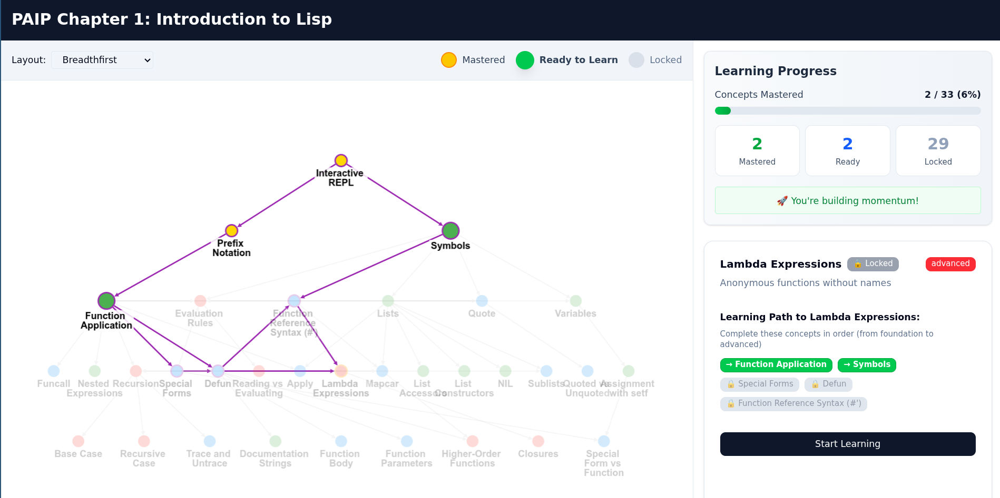
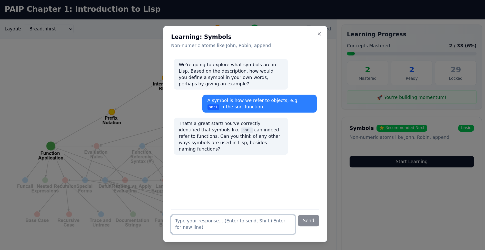

# Pedagogical Concept Graph: Interactive Learning System

An intelligent learning platform that transforms textbooks into interactive, guided learning experiences using concept graphs, Socratic dialogue, and retrieval-augmented generation (RAG).

## Overview

This project demonstrates an AI-powered approach to learning from technical textbooks. Using Peter Norvig's "Paradigms of AI Programming" (PAIP) Chapter 1 as a reference implementation, it creates a structured, interactive learning environment that adapts to each learner's progress.


*Visual navigation through prerequisite relationships - hover to preview, click to explore*


*AI tutor guides learning through Socratic questioning, tracking mastery indicators*

## Key Features

### 1. **Pedagogical Concept Graph Extraction**

The system analyzes textbook content to automatically extract:
- **Concepts**: Fundamental ideas and skills (e.g., "Recursion", "Symbols", "Quote")
- **Prerequisites**: Directed acyclic graph (DAG) of concept dependencies
- **Learning Objectives**: What students should be able to DO after mastering each concept
- **Mastery Indicators**: Specific, testable skills with difficulty levels (basic/intermediate/advanced)
- **Examples**: Code and explanations demonstrating concepts
- **Misconceptions**: Common student errors and correction strategies
- **Exercise Mappings**: Links textbook exercises to concepts they assess

**Output**: `paip-chapter-1/concept-graph.json` - A structured knowledge graph ready for interactive learning

### 2. **Interactive Graph Visualization**

Built with Next.js and Cytoscape.js, the frontend provides:
- **Visual Concept Map**: All 33 concepts displayed as an interactive graph
- **Topological Sorting**: Prerequisites automatically arranged in learning order
- **Multiple Layouts**: Dagre (hierarchical), breadthfirst, force-directed, and more
- **Smart Navigation**: 
  - Hover to preview prerequisite chains
  - Click to explore concepts in detail
  - Clickable prerequisite badges for fluid navigation
- **Progress Tracking**: Visual states for mastered/ready/locked concepts
- **Recommended Next**: System highlights optimal learning paths

**Technology**: React 19, TypeScript, Cytoscape.js, Tailwind CSS

### 3. **Socratic Dialogue System**

Each concept comes with an AI tutor that:
- **Asks Probing Questions**: Tests understanding through Socratic dialogue, not lecturing
- **Adapts to Responses**: Provides scaffolding when students struggle
- **Tracks Mastery**: Monitors which skills have been demonstrated
- **Grants Progression**: Unlocks dependent concepts only when mastery is achieved
- **Detects Misconceptions**: Uses pedagogical data to identify and correct errors

**Model**: Gemini 2.5 Flash with structured JSON output for mastery assessment

### 4. **Retrieval-Augmented Generation (RAG)**

To keep dialogue grounded in the actual textbook:
- **Semantic Chunking**: 92 chunks extracted from PAIP Chapter 1
- **Vector Embeddings**: 3072-dimensional embeddings using `gemini-embedding-001`
- **Cosine Similarity Search**: Finds most relevant textbook passages per concept
- **Client-Side Caching**: Only 1 embedding API call per dialogue session
- **Performance**: ~40% faster on subsequent turns, minimal API costs

**Result**: LLM uses Norvig's actual examples, terminology, and pedagogical approach

## Architecture

```
learning/
├── paip-chapter-1/
│   ├── concept-graph.json       # Complete pedagogical concept graph
│   ├── chunks.json              # 92 semantic chunks from textbook
│   └── embeddings.json          # Vector embeddings (3072-dim)
├── app/
│   ├── api/
│   │   └── socratic-dialogue/   # RAG + LLM dialogue endpoint
│   ├── components/
│   │   ├── ConceptGraph.tsx     # Interactive graph visualization
│   │   ├── ConceptDetails.tsx   # Concept info + prerequisites
│   │   └── SocraticDialogue.tsx # AI tutor modal
│   └── page.tsx                 # Main application
├── scripts/
│   ├── chunk-paip.ts            # Semantic chunking script
│   └── embed-chunks.ts          # Vector embedding generation
└── NOTES.md                     # Detailed design documentation
```

## Getting Started

### Prerequisites

- Node.js 18+ and npm
- Google API Key with access to Gemini API

### Installation

1. **Clone the repository**
   ```bash
   cd learning
   npm install
   ```

2. **Set up environment variables**
   ```bash
   cp .env.example .env.local
   # Edit .env.local and add your GOOGLE_API_KEY
   ```

3. **Run the development server**
   ```bash
   npm run dev
   ```

4. **Open in browser**
   ```
   http://localhost:3000
   ```

## Usage

### Exploring the Concept Graph

1. **Start at a root concept**: "Interactive REPL" or "Symbols" (highlighted in green)
2. **Hover over nodes**: Preview prerequisite chains without clicking
3. **Click a concept**: View detailed information in the sidebar
4. **Navigate prerequisites**: Click prerequisite badges to jump to related concepts
5. **Choose your layout**: Switch between graph layouts using the dropdown

### Learning with Socratic Dialogue

1. **Click "Start Learning"** on a ready concept (green)
2. **Answer the tutor's questions**: Engage in Socratic dialogue
3. **Demonstrate understanding**: Show you can apply the concept
4. **Track progress**: Watch as skills are marked as demonstrated
5. **Achieve mastery**: When ready, mark the concept as mastered
6. **Unlock new concepts**: Dependent concepts become available

### Progress Tracking

- **Gold nodes**: Concepts you've mastered ✓
- **Green with glow**: Recommended next steps ⭐
- **Green**: Ready to learn (prerequisites satisfied) ✅
- **Faded**: Locked (missing prerequisites) 🔒

Progress persists in your browser's localStorage across sessions.

## Technical Highlights

### Multi-Pass Concept Graph Extraction

The concept graph is built through three complementary passes:
1. **Pass 1 (Structure)**: Extract graph topology and basic concept info
2. **Pass 2 (Pedagogy)**: Design learning objectives and mastery indicators
3. **Pass 3 (Exercises)**: Map textbook exercises to concepts

### Semantic Search Pipeline

```typescript
// First turn: Perform semantic search
1. Embed concept name → 3072-dim vector
2. Compute cosine similarity across 92 chunks
3. Return top 5 most relevant passages
4. Cache on client-side

// Subsequent turns: Reuse cache
→ No additional embedding API calls!
```

### Structured Mastery Assessment

The LLM returns both dialogue and evaluation in structured JSON:
```json
{
  "message": "Excellent! You understand quote syntax...",
  "mastery_assessment": {
    "indicators_demonstrated": ["quote_syntax", "evaluation_blocking"],
    "confidence": 0.9,
    "ready_for_mastery": false,
    "next_focus": "when_to_quote"
  }
}
```

## Development Scripts

```bash
# Generate semantic chunks from textbook
npx ts-node scripts/chunk-paip.ts paip-chapter-1.md paip-chapter-1/chunks.json

# Generate vector embeddings
npx ts-node scripts/embed-chunks.ts paip-chapter-1/chunks.json paip-chapter-1/embeddings.json

# Merge PCG source files (Pass 1 + Pass 2 + Pass 3)
./merge_pcg.py
```

## Design Documentation

See [NOTES.md](NOTES.md) for comprehensive documentation including:
- Multi-pass extraction methodology
- Graph direction conventions
- Learning path progression strategies
- Peirastic AI (Socratic dialogue) implementation
- RAG pipeline architecture
- UI/UX design decisions
- Performance metrics and optimizations

## Future Enhancements

- [ ] Complete Pass 2 enrichment for all 33 concepts
- [ ] Spaced repetition for long-term retention
- [ ] Voice interface with Gemini Live
- [ ] Model selector (Flash vs Pro vs Thinking)
- [ ] Multi-chapter support
- [ ] Exercise session flow
- [ ] Analytics and insights

## Technology Stack

- **Framework**: Next.js 15 with App Router
- **Language**: TypeScript
- **UI**: React 19, Tailwind CSS, shadcn/ui components
- **Graph Visualization**: Cytoscape.js with multiple layout engines
- **Markdown Rendering**: react-markdown with syntax highlighting
- **AI**: Google Gemini 2.5 Flash, Gemini Embedding 001
- **State Management**: React hooks + localStorage

## License

Copyright 2025 Google LLC

Licensed under the Apache License, Version 2.0. See LICENSE file for details.

## Acknowledgments

- **Peter Norvig**: "Paradigms of AI Programming" (PAIP)
- **The Little Schemer**: Inspiration for Socratic dialogue style
- **Cytoscape.js**: Excellent graph visualization library
- **Google Gemini**: Powering the AI tutor and semantic search

---

**Built with ❤️ as an exploration of AI-powered learning systems**
