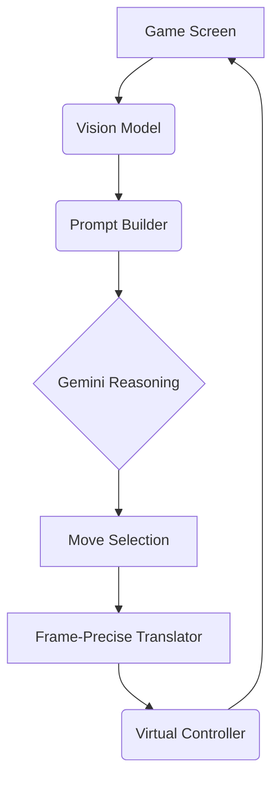

# Teaching Gemini to Play Super Smash Bros

A presentation for ODSC

---
layout: two-cols-header
---

# How the hell do you teach an LLM to fight?

::left::

This is Donkey Kong. He’s a sweet guy, but he doesn’t know what he’s doing… yet.

::right::

<video autoplay loop muted playsinline width="640">
  <source src="/dk-flail.mp4" type="video/mp4">
  Your browser does not support the video tag.
</video>

---

# What does an agent need to play a game like Smash?

<div class="text-left w-3/4 mx-auto">

- A way to **see** (game screen) <v-click/>
- A way to **think** (reason about what’s happening) <v-click/>
- A way to **act** (send precise button presses) <v-click/>
- All that, **looped every second** <v-click/>

</div>

---

# A Multi-Modal Reasoning Loop



---

# Phase 1: Random Chaos

## Baseline: Random Move Generator

```python
import random

def random_move():
    return random.choice(["jump", "left", "smash", "roll"])
```

<!-- You can embed a video here of DK flailing -->
<!-- <video src="/dk-flailing.mp4" autoplay loop controls muted class="w-2/3 mx-auto"></video> -->

“He looks like me on a Monday.”

---

# Phase 2: Multi-Modal LLM Alone

## Gemini Sees, but Doesn’t Understand

<!-- Add screenshot of DK and Mario mid-fight -->
<!--  -->

> You are Donkey Kong. What move should you do now?

<!-- Add video clip of DK walking offstage -->
<!-- <video src="/dk-walks-offstage.mp4" autoplay loop controls muted class="w-2/3 mx-auto"></video> -->

“LLMs struggle with implicit spatial reasoning.”

---

# Phase 3: Adding a Vision Model

## Roboflow: Finding Mario

```python
# Assuming a function `detect` that calls a vision model
mario_pos = detect("Mario", frame)

# Create a more informed prompt
prompt = f"You're Donkey Kong. Mario is at {mario_pos}. What do you do?"
```

<!-- Add video clip of DK punching Mario -->
<!-- <video src="/dk-punches-mario.mp4" autoplay loop controls muted class="w-2/3 mx-auto"></video> -->

“Sometimes, seeing really _is_ believing.”

---

# Phase 4: Vocabulary + Queue

## High-Level Moves → Low-Level Precision

<div class="grid grid-cols-2 gap-8">
<div>

### LLM Intent

```json
["short hop fair", "dash grab", "ledge guard"]
```

</div>
<div>

### Frame-Perfect Execution

Diagrams showing frame-by-frame inputs for each move. (e.g., `Frame 1: Press A`,
`Frame 2: Tilt Left`, etc.)

</div>
</div>

“LLMs plan, but they’re not frame-perfect. So we translated intent into
pre-programmed motion chunks.”

---

# Phase 5: Tool Use + Planning

## Gemini Calls the Shots

```python
# Gemini's output is now a structured tool call
Gemini: use(move="ledge_guard", target="Mario")
```

<!-- Visual of a queue of moves being consumed -->
<div class="font-mono text-left w-2/3 mx-auto">
<p class="p-2 bg-gray-200 rounded">Queue: [ledge_guard, dash_attack, up_smash]</p>
<p class="p-2 mt-2">Executing: <span class="text-green-500">ledge_guard</span></p>
</div>

“The LLM reasons about strategy. A toolchain handles execution.”

---

# Reasoning Constraints

## Gemini Needs Time to Think

The loop takes ~2 seconds, requiring anticipatory planning.

<div class="text-left w-3/4 mx-auto">

**Timeline of a single move:**

1.  **T+0s:** Capture Screen
2.  **T+0.5s:** Vision Model Analysis (Where is Mario?)
3.  **T+1.5s:** Gemini Reasoning (What should I do?)
4.  **T+2.0s:** Action Execution (Press buttons)

The agent isn't reacting to the present, but predicting the near future.

</div>

---

# Debugging the Agentic Mind

## LangSmith: Watching the Mind Work

<!-- Add a real LangSmith trace screenshot -->
<!--  -->

“Why did DK down-smash into thin air? Turns out, Gemini thought Mario was still
there.”

---

# Future Work

## Smarter, Faster, Stronger

<div class="text-left w-1/2 mx-auto">

- Run vision model locally for **latency**
- Try **Gemma** for faster, fine-tunable loops
- Add **platform abstraction** and **percent awareness**
- Combine **LLM for strategy** + **RL for tactics**

</div>

“The real power is in the hybrid.”

---

# Live Demo

## Live: DK Learns to Fight

<!--
This slide is for a live demonstration
-->

---
class: text-center
---

# Broader Implications

## Smash Bros is Just a Testbed

<div class="text-left w-3/4 mx-auto">

- **Strategic delegation** to LLMs
- **Tactical execution** via RL or hardcoded control
- Works in: **trading, robotics, code agents, sim games**

</div>

<br/>

> “The idea isn’t Smash. It’s that _strategy and tactics belong to different
> minds._”

---
layout: image
# Add a freeze-frame of DK doing something glorious
# image: /dk-glorious.png
---

# Q&A

Thanks — and beware the cargo-shorts Donkey Kong agent.

<div class="mt-8">
  <p>Code: github.com/your-repo/smash-ai</p>
  <p>Contact: @your-handle</p>
</div>
