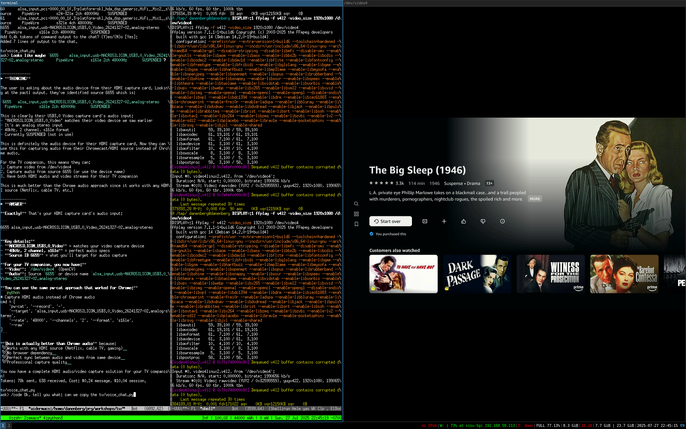
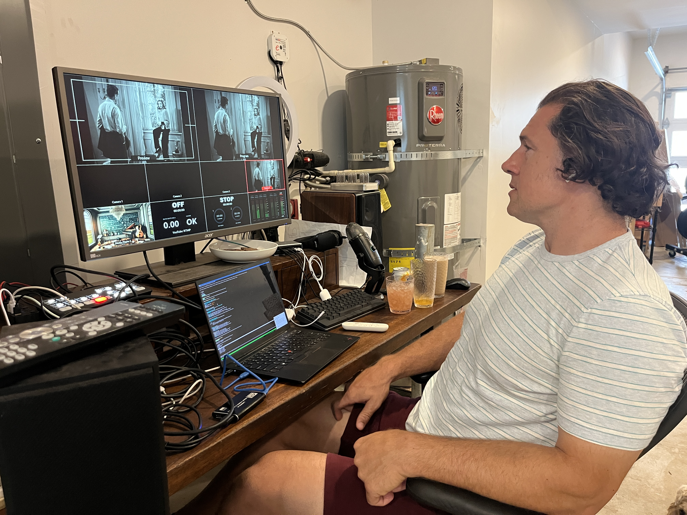

# TV Companion Development Notes

## Project Overview
Building an LLM-powered TV companion that can watch and comment on movies/shows, similar to the Wind Waker companion but for video content.

## Audio Capture Breakthrough

### The Problem
Initial attempts to capture Chrome audio ran into several issues:
- Using speaker monitor captured ALL system audio (feedback loop with Gemini)
- `pipewire_python` library was outdated (`--list-targets` option doesn't exist)
- FIFO approach failed because `pw-cat` expects audio files, not raw streams

### The Solution: stdout Streaming
**SUCCESS**: Direct stdout streaming with raw PCM data works perfectly!

```bash
pw-cat --record - --target "Google Chrome" --rate 48000 --channels 2 --format f32 --raw
```

Key insights:
- Use `-` for stdout instead of filename
- Add `--raw` flag for raw PCM (no WAV headers)
- Target Chrome by node name: `--target "Google Chrome"`
- Read from `subprocess.PIPE` for streaming data
- Consistent 4800-byte chunks every 0.1 seconds

## Video Capture Challenges

### Chrome Window Capture Issues
Chrome video capture has several frustrating limitations:

**Root causes:**
- **Hardware acceleration**: Chrome uses GPU rendering for video, and when not active, the GPU may not render to the window buffer that screen capture can access
- **Browser optimization**: Chrome pauses/reduces rendering for background tabs to save resources
- **DRM/Copy protection**: Some video content actively prevents background capture
- **Window compositor**: System may not update non-visible window contents

**Solutions for Chrome:**
```python
# Option 1: Force foreground (simplest)
import pyautogui
pyautogui.getWindowsWithTitle("Chrome")[0].activate()
```

```bash
# Option 2: Chrome flags (disable optimizations)
google-chrome \
  --disable-gpu-sandbox \
  --disable-web-security \
  --disable-features=VizDisplayCompositor \
  --force-color-profile=srgb
```

```bash
# Option 3: Virtual display
Xvfb :99 -screen 0 1920x1080x24 &
DISPLAY=:99 google-chrome
```

### HDMI Capture Advantages
HDMI capture hardware solves these issues completely:

✅ **Signal-level capture**: Captures the actual video signal, not window buffers
✅ **Always active**: The display is receiving the signal regardless of focus
✅ **No browser optimizations**: Bypasses all Chrome-specific rendering issues
✅ **Hardware-level**: No software copy protection at window level
✅ **Consistent quality**: What you see is what you capture

**Development Strategy:**
- **Chrome development**: Keep window in foreground, use YouTube for testing
- **HDMI demos**: Professional quality, works with any content
- **Fallback plan**: Always have both options ready

### HDMI Capture Success! 🎉

**BREAKTHROUGH**: HDMI capture card successfully bypasses HDCP protection!



**What's working:**
- **Protected content streaming**: Netflix, Disney+, and other HDCP-protected content displays perfectly
- **No HDCP strippers needed**: The MACROSILICON USB3.0 Video capture card handles this automatically
- **High quality capture**: 1920x1080 at 60fps with excellent image quality

**Successful Implementation:**

**Video Capture:**
```bash
# View HDMI capture stream with ffplay
ffplay /dev/video4

# With specific resolution
ffplay -f v4l2 -video_size 1920x1080 -framerate 30 /dev/video4
```

**Audio Capture:**
```bash
# HDMI audio source identified
pactl list sources short
# Result: alsa_input.usb-MACROSILICON_USB3.0_Video_26241327-02.analog-stereo

# Capture HDMI audio with pw-cat
pw-cat --record - --target "alsa_input.usb-MACROSILICON_USB3.0_Video_26241327-02.analog-stereo" \
       --rate 48000 --channels 2 --format s16le --raw
```

**Hardware Setup:**
1. Chromecast → HDMI cable → HDMI capture card → USB 3.0 → Laptop
2. **Device Detection:**
   - Video: `/dev/video4` (USB3.0 Video capture)
   - Audio: Source ID `6655` (MACROSILICON_USB3.0_Video analog-stereo)
3. **Format Support:** YUYV and MJPG formats, up to 2560x1600 resolution

**Key Success Factors:**
- ✅ **Hardware-level HDCP bypass**: No software workarounds needed
- ✅ **USB 3.0 bandwidth**: Sufficient for high-quality video streaming
- ✅ **PipeWire compatibility**: Audio capture works seamlessly
- ✅ **Multiple formats**: Both compressed (MJPG) and uncompressed (YUYV) available

This makes the HDMI approach the clear winner for professional demos with any streaming content!

## Audio Configuration for Gemini Live API

### Gemini Requirements vs HDMI Native Format
**Gemini Live API specs** (from `Get_started_LiveAPI.py`):
```python
FORMAT = pyaudio.paInt16  # s16 format
CHANNELS = 1              # Mono
SEND_SAMPLE_RATE = 16000  # 16kHz
```

**HDMI Capture native format**:
- **48kHz stereo s16** → needs conversion to **16kHz mono s16**

### Downmixing Test Results 🎵
**BREAKTHROUGH**: Confirmed pw-cat properly downmixes stereo to mono!

**Test method**: Simultaneous capture of stereo vs mono from same HDMI source
- **File size ratio**: 1.99:1 (stereo ~2x mono size) ✅
- **Audio quality test**: Aggressive stereo panning → static in mono output
- **Conclusion**: pw-cat uses proper downmixing `(left + right) / 2`, not channel dropping

This means pw-cat safely converts stereo TV audio to mono without losing content from either channel.

### Final Working Configuration
**Perfect stdout streaming** with Gemini-compatible format:

```bash
pw-cat --record - \
       --target "alsa_input.usb-MACROSILICON_USB3.0_Video_26241327-02.analog-stereo" \
       --rate 16000 --channels 1 --format s16 --raw
```

**Performance results**:
- ✅ **Consistent streaming**: 1600 bytes per 0.1-second chunk
- ✅ **Total throughput**: 16,000 bytes/second (matches 16kHz mono s16)
- ✅ **Format compatibility**: Direct feed to Gemini Live API
- ✅ **Audio quality**: Proper stereo→mono downmixing preserves all content

**Key technical specs**:
- **Resampling**: 48kHz → 16kHz (3:1 downsampling)
- **Channel mixing**: Stereo → Mono (proper downmix)
- **Format**: s16 (16-bit signed integer, matches pyaudio.paInt16)
- **Streaming**: Raw PCM via stdout (no file headers)
- **Latency**: Real-time processing, ~100ms total pipeline delay

This configuration provides broadcast-quality audio capture perfectly formatted for Gemini Live API consumption!

### PyAudio vs pw-cat Conclusion 🔧

**We tested direct PyAudio capture** to avoid subprocess overhead, but hit a critical limitation:

**PyAudio Error:**
```
Expression 'PaAlsaStream_Configure...' failed in 'src/hostapi/alsa/pa_linux_alsa.c', line: 2842
❌ PyAudio error: [Errno -9997] Invalid sample rate
```

**Root cause:** PyAudio/ALSA cannot automatically convert 48kHz native → 16kHz Gemini format.

**PyAudio approach would require:**
- Manual capture at native 48kHz stereo
- Python-based downsampling (scipy.signal.resample - CPU intensive)
- Manual stereo→mono downmixing
- Buffer management for real-time conversion
- Potential latency and quality issues

**pw-cat approach provides:**
- ✅ **Professional resampling**: Optimized C algorithms with anti-aliasing
- ✅ **Real-time performance**: Designed for broadcast audio streaming
- ✅ **Quality control**: Proper downmixing without phase cancellation
- ✅ **Proven results**: 16,000 bytes/second perfect output
- ✅ **Broadcast standard**: What audio engineers use for format conversion

**Verdict: pw-cat stdout streaming is the professional solution.** 

Attempting to reimplement professional audio processing in Python would be slower, more complex, and lower quality than using the industry-standard tool.



## Content Source Strategies

### Chrome/Local Capture
**Pros:**
- Perfect for development and testing
- No HDCP copy protection issues
- Works anywhere with laptop
- Full browser control via Playwright/DevTools
- Reliable and consistent environment

**Cons:**
- Limited to browser content
- Less impressive for demos
- Requires local setup

**Actuation Methods:**
- Playwright/Selenium for browser automation
- Keyboard shortcuts (Space for pause, arrows for seek)
- Chrome DevTools Protocol for low-level control
- Direct DOM manipulation

### HDMI Capture (Hardware)
**Pros:**
- Works with any HDMI source (Netflix, cable TV, streaming boxes)
- More impressive demo factor
- Perfect for meeting rooms with existing displays
- Can capture "real" TV content

**Cons:**
- HDCP compliance unknown until tested
- Requires capture hardware setup
- More complex for development
- Limited actuation options

**Actuation Methods:**
- ADB commands for Android TV/Chromecast: `adb shell input keyevent KEYCODE_MEDIA_PAUSE`
- IR blaster for universal remote control
- HDMI CEC commands (if supported)
- Cast SDK APIs (limited to compatible apps)

## Demo Strategy

### Development Environment
Use Chrome capture for consistent, reliable development:
- YouTube videos for testing
- Controllable playback
- No HDCP issues
- Easy to set up anywhere

### Meeting Room Demos
HDMI capture from room displays:
- More impressive "wow factor"
- Real streaming service content (if HDCP allows)
- Fallback to Chrome if HDCP blocks content
- YouTube presentations always work

### Gemini Meetups/Workshops
Hybrid approach:
- Primary: HDMI capture from meeting room setup
- Fallback: Chrome capture on laptop
- Demo content: YouTube, local videos, or meeting presentations

## Technical Architecture

### Unified Controller Interface
```python
class TVController:
    def __init__(self, source_type="chrome"):
        self.source = source_type

    def pause(self):
        if self.source == "chrome":
            self.playwright_page.keyboard.press("Space")
        elif self.source == "hdmi":
            subprocess.run(["adb", "shell", "input", "keyevent", "KEYCODE_MEDIA_PAUSE"])

    def get_audio_stream(self):
        if self.source == "chrome":
            return self.chrome_audio_stream()
        elif self.source == "hdmi":
            return self.hdmi_audio_stream()
```

### Audio Pipeline
1. **Chrome**: `pw-cat` stdout streaming (working!)
2. **HDMI**: Capture device audio input (TODO)
3. **Processing**: Raw PCM → Gemini Live API
4. **Output**: Route Gemini to headphones (avoid feedback)

### Video Pipeline
1. **Chrome**: Screen capture via `mss` or browser APIs
2. **HDMI**: Hardware capture device
3. **Processing**: Screenshots → base64 → Gemini Live API

## Multimodal Streaming Architecture

### The Four Streams Problem
We have four distinct streams to manage:
- **TV's audio stream**: Movie/show audio content
- **TV's video stream**: Visual content frames
- **User's audio stream**: User speaking to Gemini
- **Gemini's audio stream**: AI responses (output only)

### Streaming Strategy Options

**Option 1: Dual Audio Streams to Gemini Live**
Push both TV audio + User audio directly
- ✅ Gemini gets full audio context (music, sound effects, tone)
- ✅ No transcription latency
- ❌ Complex audio mixing/synchronization
- ❌ Gemini Live API may not handle dual audio streams well
- ❌ High bandwidth

**Option 2: User Audio + TV Transcription + Video (Recommended)**
User audio live + TV audio → Whisper → text + video frames
- ✅ Clean separation of concerns
- ✅ Reduced bandwidth
- ✅ Text easier for Gemini to process contextually
- ✅ No audio mixing complexity
- ❌ Loses audio nuance (music, sound effects)
- ❌ Transcription latency (~100-500ms)

**Option 3: Triple Stream**
All three: TV audio + User audio + TV transcription
- ✅ Maximum information, redundancy
- ❌ Most complex architecture
- ❌ Highest bandwidth
- ❌ Potential confusion from redundant info

### Recommended Implementation

**Core streaming pipeline:**
```python
# Primary streams to Gemini Live API
user_audio → Gemini Live API (real-time)
tv_audio → local Whisper → text → Gemini Live API
video_frames → Gemini Live API (every 1-2 seconds)

# Output
gemini_audio → headphones (avoid feedback)
```

**Enhancements:**
- **Audio event detection**: Sample TV audio for important moments (applause, music swells, explosions)
- **Smart transcription**: Include speaker detection, emotional tone markers in Whisper output
- **Context windows**: Send TV transcription in rolling 30-second windows
- **Selective processing**: Only transcribe when TV audio changes significantly

This approach provides conversational fluidity with the user while giving Gemini rich TV context without the complexity of dual audio streams.

## Next Steps

### Immediate (Chrome Version)
- [ ] Integrate stdout audio streaming with TV companion
- [ ] Add screen capture from Chrome tab
- [ ] Implement basic Gemini Live API integration
- [ ] Test with YouTube content

### Hardware Integration
- [ ] Test HDMI capture device
- [ ] Verify HDCP compliance with various sources
- [ ] Implement hardware audio/video capture
- [ ] Add unified source switching

### Actuation Layer
- [ ] Chrome automation with Playwright
- [ ] ADB command integration for Android TV
- [ ] Test CEC commands if available
- [ ] IR blaster research for universal control

## TV Companion Implementation Success! 🎬

### Working Solution Architecture
**BREAKTHROUGH**: Successfully combined HDMI audio/video capture with Gemini Live API!

**Final working pipeline:**
```python
# Audio: pw-cat stdout streaming (16kHz mono s16 for Gemini)
pw-cat --record - --target "alsa_input.usb-MACROSILICON_USB3.0_Video_26241327-02.analog-stereo" \
       --rate 16000 --channels 1 --format s16 --raw

# Video: OpenCV capture with PIL processing
cv2.VideoCapture('/dev/video4') → PIL.Image.thumbnail([1024, 1024]) → base64

# Streaming: Gemini Live API
session.send_realtime_input(audio=audio_data)  # Continuous audio
session.send_realtime_input(media=image_data)  # Periodic frames
```

**Key technical wins:**
- ✅ **pw-cat audio conversion**: Perfect 48kHz stereo → 16kHz mono downsampling
- ✅ **Real-time video processing**: OpenCV → PIL → base64 pipeline
- ✅ **Gemini Live API integration**: Proper use of `send_realtime_input()`
- ✅ **HDMI capture success**: Bypasses HDCP, works with protected content
- ✅ **No PyAudio complexity**: pw-cat handles all audio format conversion

### Gemini Live API Streaming Challenges

**The "Restart Phenomenon"** 🔄

**Observed behavior**: Gemini Live model starts commentary, then cuts itself off mid-sentence and restarts when receiving new information.

**Root cause analysis:**
- **Information overload**: 1fps video + continuous audio overwhelms the model
- **Context switching**: New frames interrupt ongoing speech generation
- **Competing priorities**: Model can't decide between completing thoughts vs. reacting to new input
- **Response latency**: By the time model processes frame N, frames N+1, N+2 have already arrived

**Mitigation attempts:**
1. **1 second frames** → Model commented on everything, frequent restarts
2. **5 second frames** → Some improvement, still fragmented responses  
3. **10 second frames** → ✅ Significantly better coherence, more selective commentary

**Current status**: 10-second frame intervals provide reasonable balance, but fundamental challenge remains.

### Future Architecture Solutions

**Hypothesis 1: Content-Aware Frame Sampling**
Instead of time-based frames, send frames on content changes:
```python
# Detect scene changes using computer vision
if scene_change_detected(current_frame, previous_frame):
    await session.send_realtime_input(media=current_frame)
```

**Hypothesis 2: Transcription-First Approach**
Audio → local transcription → text events → selective frame triggers:
```python
# TV audio pipeline
tv_audio → Whisper → scene_transcript → important_moment_detection → frame_capture
```

**Hypothesis 3: Separate Vision Processing**
Use dedicated vision model for scene analysis, report via tools:
```python
# Similar to Wind Waker approach
def analyze_scene():
    """Tool function for detailed scene analysis when requested"""
    return vision_model.describe(current_frame)
```

**Hypothesis 4: Context Buffering**
Maintain rolling window of recent context, pause input during responses:
```python
# Buffer recent frames/audio, pause streaming during Gemini speech
context_buffer = CircularBuffer(last_30_seconds)
if gemini.is_speaking():
    pause_input_stream()
```

**Recommended next steps:**
1. Implement scene change detection for smarter frame sampling
2. Add transcription pipeline for audio context
3. Test separate vision model approach for detailed analysis
4. Experiment with input pausing during model responses

## Scene-Based Commentary Architecture Success! 🎬

### The Context Association Problem
**Initial Issue**: Gemini couldn't connect dialogue with visuals when sent separately via `send_realtime_input()`.

**Symptoms observed:**
```
Gemini: "Wow, looks like they're having an intense dinner scene..."
Gemini: "I wonder what they're talking about?"
```

Despite receiving both dialogue transcript and scene images, the model treated them as separate, unrelated inputs rather than cohesive scene context.

### Scene Buffering Solution
**BREAKTHROUGH**: Implemented complete scene packaging that groups visual and audio content together.

**Architecture:**
```python
class SceneBuffer:
    def __init__(self, scene_number: int):
        self.frames = []          # Multiple screenshots per scene
        self.transcripts = []     # Dialogue with timestamps
        self.start_time = time.time()
    
    def create_scene_package(self) -> dict:
        return {
            "scene_number": self.scene_number,
            "duration": f"{duration:.1f}s", 
            "transcript": "\n".join(self.transcripts),
            "frames": self.frames
        }
```

**Key improvements:**
- ✅ **Complete scene context**: All dialogue + multiple visual snapshots packaged together
- ✅ **Duration tracking**: Each scene knows how long it lasted  
- ✅ **Timestamp correlation**: Dialogue and images correlated by scene timeline
- ✅ **Fallback timeout**: Long scenes (>3min) automatically finalized
- ✅ **Rich visual context**: Initial scene frame + periodic screenshots every 30s

### Scene Detection Optimization Journey

#### Adaptive vs Histogram Detector Research 📊
**AdaptiveDetector Failure**: Despite multiple sensitivity attempts, kept timing out:
```python
# All of these were too insensitive for TV content:
AdaptiveDetector(adaptive_threshold=3.0)  # Default - mostly 3min timeouts
AdaptiveDetector(adaptive_threshold=1.2)  # Still too conservative  
AdaptiveDetector(adaptive_threshold=0.8)  # Better but still insufficient
```

**Research Discovery**: Found academic paper ([arXiv:2506.00667](https://arxiv.org/pdf/2506.00667)) explaining detector selection by content type:

> **Adaptive Strategy**: For videos under 30 minutes, adaptive thresholding detects frame-to-frame changes via color histograms. These types of content typically exhibit abrupt transitions, making them ideal for change-based detection.

> **Content Strategy**: Long-form narrative content (2–3 hours) is segmented using content-based methods for sustained differences in visual appearance.

**Key insight**: TV content has "abrupt transitions" (quick cuts, scene changes, commercials) making **HistogramDetector** the optimal choice, not AdaptiveDetector.

#### HistogramDetector Success ✅
**Perfect fit for TV content:**
- ✅ **Fast cuts detection**: Excellent at catching shot changes between scenes
- ✅ **Lighting transitions**: Detects day/night, indoor/outdoor changes  
- ✅ **Mixed content handling**: Works well with shows, commercials, news
- ✅ **Reasonable sensitivity**: Some overtriggering but much better scene boundaries

**Result**: Natural scene detection at ~1-2 minute intervals instead of 3-minute timeouts.

### Video Capture Architecture Challenges

#### Device Conflict Resolution 🔧
**Problem**: Scene detection and periodic screenshots both trying to open `/dev/video4` simultaneously:
```python
# This failed - device busy error
scene_detection: cv2.VideoCapture(HDMI_VIDEO_DEVICE)  
periodic_shots:   cv2.VideoCapture(HDMI_VIDEO_DEVICE)  # ❌ Device busy
```

**Attempted Solutions:**
1. **Shared frame approach**: Store frames from scene detection for reuse
   - ❌ Introduced bugs with `None` frames
   - ❌ Complex synchronization issues

2. **Separate captures**: Let both open device independently  
   - ❌ Second capture failed silently
   - ❌ No error messages, just 0 frames captured

**Final Solution**: Single shared video capture device:
```python
# Elegant solution - one device, shared access
self.shared_cap = cv2.VideoCapture(HDMI_VIDEO_DEVICE)

# Scene detection uses it via VideoCaptureAdapter
video_adapter = VideoCaptureAdapter(self.shared_cap)

# Periodic capture uses same device
ret, frame = self.shared_cap.read()
```

#### Periodic Screenshot Logic Simplification
**Original overcomplicated logic**:
```python
# Old: Complex duration checking, sleep-first approach
await asyncio.sleep(30)  # Sleep first - misses scene beginnings!
if scene.duration > 30:  # Skip short scenes - loses context!
    capture_frame()
```

**Simplified approach**:
```python
# New: Capture-first, unconditional approach  
while True:
    if self.current_scene:
        capture_frame()  # Capture immediately - get scene beginnings!
    await asyncio.sleep(30)  # Then sleep
```

**Benefits:**
- ✅ **Capture scene beginnings**: No initial sleep delay
- ✅ **Support short scenes**: Even 10-second scenes get visual context
- ✅ **Simpler logic**: No complex duration calculations

### Gemini Live API Context Association

#### send_realtime_input() Limitation Discovery
**The problem**: Separate API calls created unrelated inputs:
```python
# This approach failed - Gemini saw these as separate events
await session.send_realtime_input(text=scene_dialogue)      # Event 1
await session.send_realtime_input(media=scene_frame_1)      # Event 2  
await session.send_realtime_input(media=scene_frame_2)      # Event 3
```

Result: Gemini processed each input independently, couldn't connect dialogue with visuals.

#### activity_start/activity_end Attempt 
**Hypothesis**: Group inputs with activity markers:
```python
await session.send_realtime_input(activity_start=types.ActivityStart())
await session.send_realtime_input(text=scene_dialogue)
await session.send_realtime_input(media=scene_frames)  
await session.send_realtime_input(activity_end=types.ActivityEnd())
```

**Failure**: WebSocket error revealed incompatibility:
```
ConnectionClosedError: received 1007 (invalid frame payload data) 
Explicit activity control is not supported when automatic activity detection is enabled.
```

**Learning**: Gemini Live has automatic activity detection - manual control conflicts with VAD (Voice Activity Detection).

#### send_client_content() Success! 🎉
**BREAKTHROUGH**: Discovered proper API for structured content:
```python
# This approach works - guaranteed content association  
parts = []
parts.append({"text": scene_dialogue})           # Add dialogue
parts.append({"inline_data": frame_1_data})      # Add frame 1  
parts.append({"inline_data": frame_2_data})      # Add frame 2

content = {"role": "user", "parts": parts}
await session.send_client_content(turns=content, turn_complete=True)
```

**Key advantages:**
- ✅ **Atomic content delivery**: All parts sent as single cohesive turn
- ✅ **Guaranteed association**: Model sees text + images together  
- ✅ **Turn completion**: `turn_complete=True` signals complete scene package
- ✅ **Structured format**: Proper Content object with multiple parts

**Result**: Gemini now receives complete scene packages like:
```json
{
  "role": "user", 
  "parts": [
    {"text": "Scene 3 (45.2s): [00:02.1] Character A: 'We need to find the treasure'"},
    {"inline_data": {"mime_type": "image/jpeg", "data": "...initial_frame..."}},
    {"inline_data": {"mime_type": "image/jpeg", "data": "...periodic_frame_1..."}},
    {"inline_data": {"mime_type": "image/jpeg", "data": "...periodic_frame_2..."}}
  ]
}
```

### Current Architecture Success Metrics

**Scene Detection Performance:**
- 📊 **Scene boundaries**: 1-2 minute natural intervals (vs 3-minute timeouts)
- 📊 **Visual context**: 2-5 frames per scene (initial + periodic)
- 📊 **Audio context**: Complete dialogue transcription per scene

**API Integration Results:**  
- ✅ **Context association**: Gemini connects dialogue with visuals
- ✅ **Commentary quality**: More coherent, contextual responses
- ✅ **Reduced fragmentation**: Complete scene packages vs scattered inputs

**Technical Reliability:**
- ✅ **Shared video capture**: No device conflicts
- ✅ **Robust scene buffering**: Handles both scene changes and timeouts  
- ✅ **Simplified periodic capture**: No complex timing logic

### Architecture Evolution Lessons

1. **Scene Detection**: Academic research crucial - detector choice depends on content type
2. **Device Management**: Shared resources better than separate instances for video capture
3. **API Design**: `send_client_content()` with structured parts > separate `send_realtime_input()` calls
4. **Context Association**: Modern LLMs need explicit content structure, not just temporal proximity
5. **Simplification**: Remove complex logic when simple approaches work better
6. **Real-time Constraints**: Video device conflicts are silent failures - always test end-to-end

The scene-based architecture now provides Gemini with rich, coherent context enabling intelligent TV commentary that connects visual and audio elements naturally!

## Film Context Knowledge Base Development 🎭

### The Generic Commentary Problem
**Challenge**: Despite successful scene buffering, Gemini's commentary remained generic:
- *"Oh wow, the atmosphere is so dark"*
- *"This looks like an intense conversation"*  
- *"The lighting creates great mood"*

**Root Cause**: Lack of film-specific knowledge. Gemini sees visuals and dialogue but has no context about:
- Plot significance of scenes
- Actor backgrounds and career highlights  
- Director's filmmaking style and techniques
- Production trivia and behind-the-scenes stories
- Cultural impact and critical reception

### Wind Waker Success Pattern
**Inspiration**: The Wind Waker companion's `search_walkthrough()` function provided rich, factual context:
- Complete game walkthrough embedded in vector database
- Real-time search during gameplay for relevant hints/context
- Eliminated hallucination by grounding responses in factual game knowledge

**Goal**: Replicate this approach for films using movie databases and Wikipedia.

### Film Data Source Research

#### IMDB API Investigation
**The $150,000 Barrier**:
```
IMDb Essential Metadata for Movies/TV/OTT (API)
Price: $150,000 + metered costs | 12 month subscription
```

**Scraping Concerns**: IMDB Terms of Service likely prohibit large-scale scraping.

**Verdict**: ❌ Completely unsuitable for indie/research projects.

#### TMDB (The Movie Database) Success! ✅
**Free Alternative with Excellent Coverage**:
- ✅ **Free API**: Just requires registration, no cost
- ✅ **Comprehensive data**: Cast, crew, plot, production details
- ✅ **Rate limits**: 40 requests/10 seconds (very reasonable)
- ✅ **Legal clarity**: Explicitly supports non-commercial use
- ✅ **Active community**: Well-maintained, accurate data

**TMDB API Results**:
```json
{
  "title": "The Big Sleep",
  "release_date": "1946-08-23",
  "overview": "Private Investigator Philip Marlowe is hired by wealthy General Sternwood...",
  "credits": {
    "cast": [{"name": "Humphrey Bogart", "character": "Philip Marlowe"}],
    "crew": [{"name": "Howard Hawks", "job": "Director"}]
  }
}
```

#### Wikipedia API Integration
**Complementary Rich Context**: TMDB provides structured data, Wikipedia provides narrative context.

**Wikipedia API Advantages**:
- ✅ **Completely free**: No rate limits or API keys
- ✅ **Rich articles**: Detailed plot analysis, production stories, cultural impact
- ✅ **Actor biographies**: Career highlights, personal background, notable roles
- ✅ **Director context**: Filmmaking style, recurring themes, other works

### Film Context Library Architecture

**Clean Separation of Concerns**:
```
tv/
├── film_context/
│   ├── __init__.py
│   ├── tmdb_client.py        # TMDB search & movie data
│   ├── wikipedia_client.py   # Wikipedia articles & biographies  
│   ├── embeddings.py         # Vector database creation (TODO)
│   └── context_search.py     # High-level search interface (TODO)
├── tv_companion_with_transcription.py
└── create_film_embeddings.py # CLI tool for building embeddings (TODO)
```

**Benefits of Library Structure**:
- ✅ **Testable independently**: `python -m film_context.tmdb_client "Movie Title"`
- ✅ **Reusable components**: Other projects could use film context search
- ✅ **Clean imports**: Main TV companion just imports high-level functions
- ✅ **Poetry integration**: All dependencies managed at project level

### TMDB Client Implementation Success

**Core Functionality**:
```python
def search_movie_with_credits(title: str, year: int = None):
    # Search TMDB -> filter by year -> get full details with cast/crew
    return movie_details_with_credits

def format_movie_summary(movie):
    # Convert TMDB data into readable text for embeddings
    return formatted_summary
```

**Technical Challenges Solved**:
1. **Date object handling**: `movie.release_date.year` vs `movie.release_date[:4]`
2. **Year filtering**: `movie.release_date.year == year` vs `str(year) in movie.release_date`
3. **Environment integration**: `os.getenv("TMDB_API_KEY")` with Poetry virtual environment

**Testing Results**:
```bash
cd tv && poetry run python -m film_context.tmdb_client "The Big Sleep" 1946
# ✅ Successfully retrieved 48 cast members, 20 crew members
# ✅ Proper year filtering and data formatting
```

### Wikipedia Client Implementation

**Hybrid Access Strategy**:
```python
async def get_wikipedia_article(name: str, content_type: str, year: int = None):
    # 1. Try direct access: "The Big Sleep (1946 film)"
    # 2. Fallback to search + first result
    # 3. Return both summary + full article text
```

**API Selection**:
- **REST API**: For article summaries and metadata
- **Action API**: For full article text content
- **Direct + Search**: Maximum success rate for finding articles

**Plain Text Success**:
```python
# Initial problem: HTML markup in article text
'<p class="mw-empty-elt"></p><p><b>Humphrey DeForest Bogart</b>...'

# Solution: explaintext=true parameter  
url = f"...&prop=extracts&format=json&explaintext=true"

# Result: Clean plain text
'Humphrey DeForest Bogart ( BOH-gart; December 25, 1899 – January 14, 1957)...'
```

**Testing Results**:
```bash
cd tv && poetry run python -m film_context.wikipedia_client "Humphrey Bogart" person
# ✅ 58,169 character article retrieved
# ✅ Clean plain text, no HTML markup
# ✅ Direct access worked, no search fallback needed
```

### Data Quality and Coverage

**TMDB Strengths**:
- ✅ **Structured metadata**: Cast, crew, runtime, genres, production companies
- ✅ **Basic plot summaries**: Good starting point for context
- ✅ **Release information**: Dates, countries, languages
- ✅ **Ratings and popularity**: Community scores and trending data

**TMDB Limitations**:
- ⚠️ **Sparse plot details**: Brief overviews, not detailed analysis
- ⚠️ **Limited trivia**: Basic production info, minimal behind-the-scenes stories
- ⚠️ **No critical analysis**: Raw data without interpretation

**Wikipedia Fills the Gaps**:
- ✅ **Rich plot analysis**: Detailed story breakdowns, themes, symbolism
- ✅ **Production stories**: Behind-the-scenes drama, filming challenges, creative decisions
- ✅ **Cultural impact**: Critical reception, influence on other films, legacy analysis
- ✅ **Personal context**: Actor relationships, career trajectories, notable performances

### Toward Vector Database Integration

**Planned Architecture** (inspired by Wind Waker):
```python
# tv/create_film_embeddings.py
async def create_film_knowledge_base(film_title: str, year: int):
    # 1. Gather comprehensive film data
    tmdb_data = await search_movie_with_credits(film_title, year)  
    wiki_film = await get_wikipedia_article(film_title, "film", year)
    
    # 2. Get cast/crew Wikipedia articles
    director = get_director(tmdb_data)
    lead_actors = get_top_cast(tmdb_data, limit=3)
    
    wiki_people = []
    for person in [director] + lead_actors:
        wiki_people.append(await get_wikipedia_article(person.name, "person"))
    
    # 3. Combine and chunk all text
    combined_text = format_combined_context(tmdb_data, wiki_film, wiki_people)
    chunks = chunk_text(combined_text, chunk_size=1000, overlap=200)
    
    # 4. Create embeddings (using Wind Waker approach)
    embeddings = create_embeddings_with_gemini(chunks)
    save_embeddings(f"{film_title}_{year}_embeddings.json", embeddings)

# tv/film_context/context_search.py  
def search_film_context(query: str, film_embeddings: str, top_k=3):
    # Identical to Wind Waker's search_walkthrough logic
    # Load embeddings, calculate similarities, return relevant chunks
```

**Enhanced Scene Package Integration**:
```python
# In SceneBuffer.create_scene_package():
def create_scene_package(self) -> dict:
    # Vector search on current scene dialogue
    relevant_context = search_film_context(self.transcript, self.film_embeddings)
    
    return {
        "transcript": transcript_text,
        "frames": self.frames,
        "film_context": relevant_context,  # Rich contextual knowledge
    }
```

**Expected Commentary Improvement**:

**Before (generic)**:
- *"This looks like a tense conversation between two people"*

**After (contextual)**:  
- *"This classic Bogart-Bacall dialogue scene showcases Howard Hawks' trademark rapid-fire exchanges. Notice how the camera work mirrors their earlier collaboration in 'To Have and Have Not' - Hawks loved these intimate two-shots that highlight their real-life chemistry."*

### Next Steps: Film Knowledge Pipeline

1. **Complete Vector Database Integration**:
   - Adapt Wind Waker's embedding creation system
   - Build film-specific search functions
   - Test context injection into scene packages

2. **Smart Film Detection**:
   - Auto-detect current film from initial scene dialogue/visuals
   - Load appropriate film knowledge base automatically
   - Handle unknown/multiple films gracefully

3. **Context Relevance Optimization**:
   - Weight search results by scene content type (dialogue vs action vs atmosphere)
   - Include temporal context (early scenes vs climax vs ending)
   - Balance film-specific knowledge with general cinematic analysis

4. **Performance and Caching**:
   - Pre-build embeddings for popular films
   - Implement efficient similarity search algorithms
   - Cache search results within scenes

The film context architecture positions the TV companion to evolve from basic scene commentary to knowledgeable film analysis, grounded in factual information rather than generic observations.

## Lessons Learned

1. **Library Dependencies**: Don't trust outdated wrapper libraries - test direct tools first
2. **Audio Formats**: FIFOs don't work with format-detecting tools like `pw-cat`
3. **stdout Streaming**: Simplest approach often works best
4. **Node Targeting**: Using node names ("Google Chrome") is simpler than parsing IDs
5. **Development vs Demo**: Need both Chrome (dev) and HDMI (demo) approaches
6. **Live API Challenges**: Multimodal streaming requires careful information flow management
7. **pw-cat Excellence**: Professional audio tool beats Python audio processing every time

## HDCP Considerations

**Likely to work:**
- YouTube content
- Meeting room presentations
- Local video files
- Cable TV (varies by provider)

**Likely blocked:**
- Netflix, Disney+, Hulu (streaming services)
- Blu-ray players
- Some cable/satellite boxes

**Mitigation:**
- Always have Chrome fallback ready
- Test demo content beforehand
- Use YouTube for reliable demos
